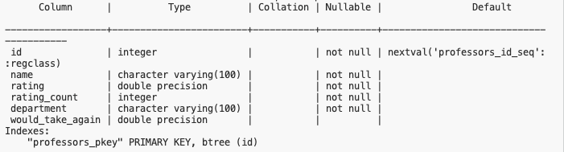
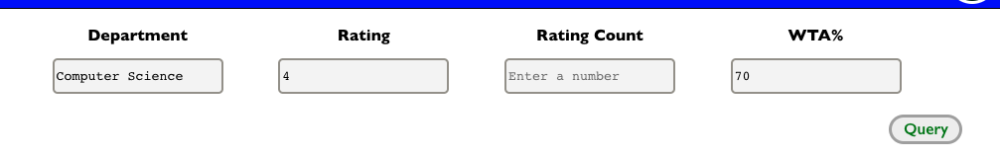

# Rate My Prof Query

This is an application that allows you to query professors by different fields as they appear on https://www.ratemyprofessors.com/. 

While on rate my professor you can query by name, this application allows you to filter the professors with more fields like would take again %, rating number, and rating count.

Currently this works for Vanderbilt University, but will expand to include more schools in the future.

## Installation

1.) Clone the repository

2.) Go into backend
```bash
cd backend
```
Install the requirements:
```bash
pip3 install -r requirements.txt
```
3.) Go into client
```bash
cd client
```
Install dependencies
```bash
npm install
```

4.) I scraped the professors off of rate my professor which is then transformed into `data_cleaned.csv`. You need to load this in order to have results when querying. So, once you create a database with a table named professors with this schema:



Then run:

```python3 db.py``` in the ```backend``` folder

Your table should be populated now, and everything should work.

## Usage
Enter values for each of the fields. All fields are optional. For numeric fields, entering a value will return all items greater than or equal to the inputted number.



The professors that meet the required criteria will be displayed in the results section.


## Future Enhancements
- Add more schools
- Query by difficulty level